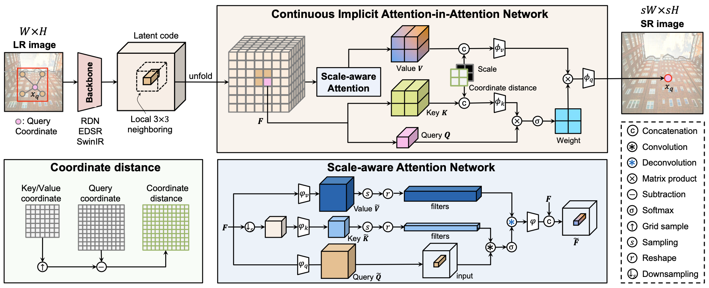
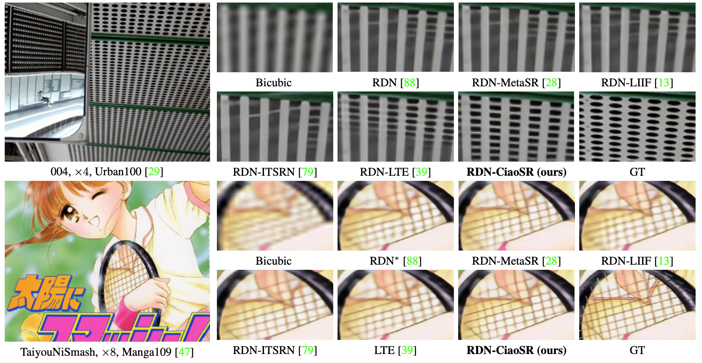

# CiaoSR: Continuous Implicit Attention-in-Attention Network for Arbitrary-Scale Image Super-Resolution (CVPR 2023)

[Jiezhang Cao](https://www.jiezhangcao.com/), [Qin Wang](https://www.qin.ee/), [Yongqin Xian](https://xianyongqin.github.io/), [Yawei Li](https://ofsoundof.github.io/), [Bingbing Ni](), [Zhiming Pi](), [Kai Zhang](https://cszn.github.io/), [Yulun Zhang](http://yulunzhang.com/), [Radu Timofte](https://www.informatik.uni-wuerzburg.de/computervision/home/), [Luc Van Gool](https://scholar.google.com/citations?user=TwMib_QAAAAJ&hl=en)

Computer Vision Lab, ETH Zurich.

---

[arxiv](https://arxiv.org/abs/2212.04362)
**|**
[supplementary](https://github.com/caojiezhang/CiaoSR/releases)
**|**
[pretrained models](https://github.com/caojiezhang/CiaoSR/releases)
**|**
[visual results](https://github.com/caojiezhang/CiaoSR/releases)

[](https://arxiv.org/abs/2212.04362)
[](https://github.com/caojiezhang/CiaoSR)
[](https://github.com/caojiezhang/CiaoSR/releases)


This repository is the official PyTorch implementation of "CiaoSR: Continuous Implicit Attention-in-Attention Network for Arbitrary-Scale Image Super-Resolution"
([arxiv](https://arxiv.org/abs/2212.04362), [supp](https://github.com/caojiezhang/CiaoSR/releases/download/v0.0/supplementary.pdf), [pretrained models](https://github.com/caojiezhang/CiaoSR/releases), [visual results](https://github.com/caojiezhang/CiaoSR/releases)). CiaoSR achieves state-of-the-art performance in arbitrary-scale image super-resolution. 

<p align="center">
  <a href="https://github.com/caojiezhang/CiaoSR/releases">
    
    <!--  -->
  </a>
</p>

---

> Learning continuous image representations is recently gaining popularity for image super-resolution (SR) because of its ability to reconstruct high-resolution images with arbitrary scales from low-resolution inputs. Existing methods mostly ensemble nearby features to predict the new pixel at any queried coordinate in the SR image. Such a local ensemble suffers from some limitations: i) it has no learnable parameters and it neglects the similarity of the visual features; ii) it has a limited receptive field and cannot ensemble relevant features in a large field which are important in an image. To address these issues, this paper proposes a continuous implicit attention-in-attention network, called CiaoSR. We explicitly design an implicit attention network to learn the ensemble weights for the nearby local features. Furthermore, we embed a scale-aware attention in this implicit attention network to exploit additional non-local information. Extensive experiments on benchmark datasets demonstrate CiaoSR significantly outperforms the existing single image SR methods with the same backbone. In addition, CiaoSR also achieves the state-of-the-art performance on the arbitrary-scale SR task. The effectiveness of the method is also demonstrated on the real-world SR setting. More importantly, CiaoSR can be flexibly integrated into any backbone to improve the SR performance. 
<p align="center">
  
</p>

#### Contents

1. [Requirements](#Requirements)
1. [Quick Testing](#Quick-Testing)
1. [Training](#Training)
1. [Results](#Results)
1. [Citation](#Citation)
1. [License and Acknowledgement](#License-and-Acknowledgement)


## TODO
- [ ] Add pretrained model
- [ ] Add results of test set
- [ ] Add real-world arbitrary-scale SR

## Requirements
> - Platforms: Ubuntu 18.04, cuda-11.1
> - Python 3.8, PyTorch >= 1.9.1
> - [mmedit](https://openi.pcl.ac.cn/open-mmlab/mmediting.git) 0.11.0

```bash
# install mmcv
pip install --no-cache-dir --ignore-installed mmcv-full -f https://download.openmmlab.com/mmcv/dist/cu110/torch1.9.1/index.html 

# download mmediting from https://openi.pcl.ac.cn/open-mmlab/mmediting.git
cd mmediting
python setup.py develop
```

## Quick Testing
Following commands will download [pretrained models](https://github.com/caojiezhang/CiaoSR/releases) and [test datasets](https://github.com/caojiezhang/CiaoSR/releases). If out-of-memory, try to reduce `tile` at the expense of slightly decreased performance.

```bash
# download code
git clone https://github.com/caojiezhang/CiaoSR
cd CiaoSR


PYTHONPATH=/bin/..:tools/..: python tools/test.py configs/001_localimplicitsr_rdn_div2k_g1_c64b16_1000k_unfold_lec_mulwkv_res_nonlocal.py pretrain_model/rdn-ciaosr.pth

```

**All visual results of CiaoSR can be downloaded [here](https://github.com/caojiezhang/CiaoSR/releases)**.


## Training

```bash

PYTHONPATH=/bin/..:tools/..: ./tools/dist_train.sh configs/001_localimplicitsr_rdn_div2k_g1_c64b16_1000k_unfold_lec_mulwkv_res_nonlocal.py 8

```

## Results
We achieved state-of-the-art performance on arbitrary-scale iamge super-resolution. Detailed results can be found in the [paper](https://arxiv.org/abs/2212.04362).

<p align="center">
  
</p>


## Citation
  ```
  @inproceedings{cao2023ciaosr,
    title={CiaoSR: Continuous Implicit Attention-in-Attention Network for Arbitrary-Scale Image Super-Resolution},
    author={Cao, Jiezhang and Wang, Qin and Xian, Yongqin and Li, Yawei and Ni, Bingbing and Pi, Zhiming and Zhang, Kai and Zhang, Yulun and Timofte, Radu and Van Gool, Luc},
    booktitle={The IEEE Computer Vision and Pattern Recognition},
    year={2023}
  }
  ```

## License and Acknowledgement
This project is released under the CC-BY-NC license. We refer to codes from [KAIR](https://github.com/cszn/KAIR), [BasicSR](https://github.com/xinntao/BasicSR), and [mmediting](https://github.com/open-mmlab/mmediting). Thanks for their awesome works. The majority of CiaoSR is licensed under CC-BY-NC, however portions of the project are available under separate license terms: KAIR is licensed under the MIT License, BasicSR, and mmediting are licensed under the Apache 2.0 license.
